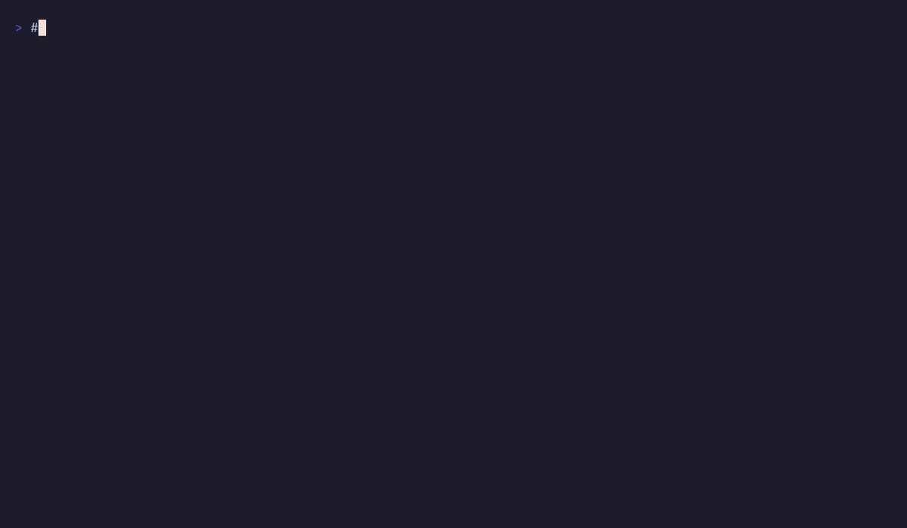

# a2migrate

**Move your Claude Code sessions, skills, agents, and MCP servers to
OpenCode — and back.**

[](https://github.com/MrMirhan/a2migrate/actions/workflows/ci.yml)
[](https://pkg.go.dev/github.com/MrMirhan/a2migrate)
[](https://go.dev/dl/)
[](./LICENSE)

Switched AI coding tools and left your chat history behind? `a2migrate`
is a single Go binary that migrates Claude Code session transcripts —
the JSONL files under `~/.claude/projects/` — into OpenCode's SQLite
database and back again, along with your skills, slash commands,
subagents, rules, MCP servers, and `CLAUDE.md` / `AGENTS.md`
instructions.

Nothing is lost in transit: assistant reasoning blocks, tool calls with
their inputs and outputs, subagent chains, and per-message token usage
all survive the round trip. Every command is idempotent and has a
`--dry-run`.

Tools are arguments, not commands. `a2migrate migrate <from> <to>` moves
state one way, swapping the two moves it back, and `sync` keeps both
sides in lock-step over time.



## Supported tools

| Tool | Status |
|---|---|
| [Claude Code](https://claude.com/claude-code) (Anthropic) | migrates both ways today |
| [OpenCode](https://opencode.ai) | migrates both ways today |
| Codex, Qwen Code, Gemini CLI, Factory Droid | adapter scaffolding in place, format parsers pending |

Adding a tool does not add commands — it is one registry entry, and
every verb starts accepting it. See
[Adding a new target system](./architecture.md#adding-a-new-target-system).

## Quick start

```sh
# See what would migrate, with zero side effects.
a2migrate list claude-code sessions
a2migrate migrate claude-code opencode sessions --dry-run --search "refactor auth"

# Migrate one session (with a timestamped backup before apply).
a2migrate migrate claude-code opencode sessions --search "bug fix" --backup --yes

# Migrate everything both tools support, in one shot.
a2migrate migrate claude-code opencode --backup --yes

# Push OC sessions back into CC (e.g. you bounced between tools).
a2migrate migrate opencode claude-code sessions --yes

# Keep both sides in sync after every session ends.
a2migrate sync
```

`cc` and `oc` are accepted as shortcuts, so `a2migrate migrate cc oc` is
the same thing. Naming no domains migrates every domain both tools
support; naming some (`skills agents`) limits the run to those.

## Install

### Homebrew (macOS)

```sh
brew install --cask MrMirhan/tap/a2migrate
```

Homebrew casks are macOS-only. On Linux, use `go install` or a release
tarball below.

### `go install`

Requires Go 1.25+.

```sh
go install github.com/MrMirhan/a2migrate/cmd/a2migrate@latest
```

### Build from source

```sh
git clone https://github.com/MrMirhan/a2migrate
cd a2migrate
make build          # produces ./a2migrate
```

### Download a binary

Grab the latest release for your platform:
[github.com/MrMirhan/a2migrate/releases/latest](https://github.com/MrMirhan/a2migrate/releases/latest)

- macOS Apple Silicon: `a2migrate_Darwin_arm64.tar.gz`
- macOS Intel: `a2migrate_Darwin_x86_64.tar.gz`
- Linux arm64: `a2migrate_Linux_arm64.tar.gz`
- Linux x86_64: `a2migrate_Linux_x86_64.tar.gz`
- Windows: `a2migrate_Windows_x86_64.zip`

```sh
# Example: Linux x86_64
curl -fsSL -o a2migrate.tar.gz \
  https://github.com/MrMirhan/a2migrate/releases/latest/download/a2migrate_Linux_x86_64.tar.gz
tar -xzf a2migrate.tar.gz
sudo mv a2migrate /usr/local/bin/
a2migrate version
```

Checksums are published alongside as `a2migrate_<version>_SHA256SUMS`.

### Verify

```sh
a2migrate version
# a2migrate v0.1.0 (commit ..., built ..., linux/amd64, go1.25)
```

## Features

### Migration (one-shot, copy semantics)

- **Sessions** — JSONL transcripts → SQLite rows (CC→OC) or vice versa.
  Includes user prompts, assistant text, reasoning blocks, tool calls
  with input/output, subagent chains via `session.parent_id`. Preserves
  per-message `message.usage` (CC) ↔ `message.data.tokens` (OC).
- **Skills** — markdown files copied with frontmatter round-tripped;
  lives in `~/.config/opencode/skills/` and `<cwd>/.opencode/skills/`.
- **Commands** — slash command definitions copied with their
  `argument-hint` and `allowed-tools` fields preserved.
- **Agents** — subagent definitions with model + tools preserved.
- **Rules** — path-scoped rule files with their `paths:` glob patterns.
- **MCP servers** — `mcpServers{}` ↔ `mcp{}` with `command[]` split /
  merge.
- **CLAUDE.md ↔ AGENTS.md** — the top-level system-prompt file that
  each tool injects into every session's context.

### Sync (continuous, reconcile semantics)

- **mtime last-writer-wins** for file artifacts. Files on only one side
  propagate to the other. Mtime is preserved across copies, so re-runs
  are no-ops.
- **uuid-deduped append-only** for sessions. New CC messages get
  appended to OC, and vice versa, with the CC `uuid` recorded in OC's
  `message.data` so duplicates are detected and skipped.
- **Bail when nothing is newer** — `sync` finishes instantly if both
  sides are already in sync.

### Cross-cutting

- **Idempotent.** Every code path is safe to re-run. Already-migrated
  sessions are detected via `claude_code_origin` metadata and skipped.
- **Transactional.** Session writes into OpenCode run in a single SQL
  transaction. `--backup` snapshots the target first in either
  direction: the SQLite file for OpenCode, and every JSONL file about to
  be overwritten (subagent transcripts included) for Claude Code.
- **Self-healing.** Post-fix invariants restore the four renderer
  requirements: assistant→user reparents, step-start/step-finish get
  padded with native fields, bare step-start gets a `time` block, every
  tool part gets `state.time.compacted`.
- **Cross-platform.** Linux, macOS, Windows. Pure-Go SQLite (no CGo).
- **Cross-architecture.** Builds on `linux/amd64`, `linux/arm64`,
  `darwin/amd64`, `darwin/arm64`, `windows/amd64`.

## Commands

```
a2migrate
├── migrate <from> <to> [domain...]
│     [--backup] [--dry-run] [--search] [--include] [--exclude]
│     [--rename old=new] [--skip-repair] [--skip-native] [--yes]
│     [--cwd] [--source-path] [--target-path]
├── list    <tool> [domain]     what that tool has on disk
├── show    <tool> <id>         one session's details
├── select  <tool>              interactive picker
├── verify  <tool>              what has been migrated in, and from where
├── repair  <tool>              re-run post-migration invariants
│
├── sync                     bidirectional CC↔OC reconciler
│   ├── all                  artifacts + sessions in both directions
│   ├── artifacts            mtime last-writer-wins
│   ├── sessions             CC → OC, append-only
│   └── reverse              OC → CC, append-only
│
├── tools                    list known AI CLIs (registry surface)
│   ├── list
│   └── show <id>            paths + capabilities for one tool
│
└── version
```

`<tool>` is any id from `a2migrate tools list` (`claude-code`,
`opencode`, plus `cc` / `oc` shortcuts). `<domain>` is one of
`sessions`, `skills`, `commands`, `agents`, `rules`, `mcp`, `system`.

The command list does not grow when a tool is added — a new tool is one
registry entry, and every verb above starts accepting it. Shell
completion is driven by the same registry: the second argument to
`migrate` excludes whatever you named first, and the domain arguments
offer only what both tools declare support for, so an unsupported
combination cannot be completed into existence.

| Domain | Claude Code | OpenCode |
|---|---|---|
| `skills` | `~/.claude/skills/` | `~/.config/opencode/skills/` |
| `commands` | `.claude/commands/` | `.opencode/command/` |
| `agents` | `.claude/agents/` | `.opencode/agent/` |
| `rules` | `.claude/rules/` | `.opencode/rules/` |
| `mcp` | `mcpServers{}` | `mcp{}` |
| `system` | `CLAUDE.md` | `AGENTS.md` |
| `sessions` | `projects/*/*.jsonl` | `opencode.db` |

## What gets preserved

| Field | CC → OC | OC → CC |
|---|---|---|
| Message role / agent / model | yes | yes |
| Per-message `input_tokens`, `output_tokens`, `cache_read_tokens`, `cache_write_tokens` | yes | yes |
| Reasoning blocks | yes | yes |
| Tool calls (input + output) | yes | yes |
| Subagent chains | yes (`session.parent_id`) | yes (`bridge-session` + dir nesting) |
| Session title | yes | yes |
| Project directory | yes | yes |
| `time.completed` per message | n/a (OC only) | yes |
| Cost (`cost_usd` extension field on JSONL) | n/a (CC has no cost data) | yes |
| `last-prompt` / `attachment` / `queue-operation` records | dropped (no OC analog) | dropped (no CC analog) |
| Reasoning signatures (for model-side replay) | dropped | n/a |
| Plugin marketplace state / daemon / settings / credentials | not touched | not touched |

## Environment variables

| Variable | Effect |
|---|---|
| `CLAUDE_CODE_HOME` | Override `~/.claude`. |
| `OPENCODE_DATA_HOME` | Override `~/.local/share/opencode/`. |
| `OPENCODE_CONFIG_HOME` | Override `~/.config/opencode/`. |
| `OPENCODE_DISABLE_CLAUDE_CODE` | If set, OpenCode will not read anything from `~/.claude/`. |
| `OPENCODE_DISABLE_CLAUDE_CODE_PROMPT` | Suppress only the `~/.claude/CLAUDE.md` fallback. |
| `A2MIGRATE_LOG_LEVEL` | Override log level (`error`, `warn`, `info`, `debug`). |

XDG Base Directory spec is followed on Linux. macOS uses
`~/Library/...`. Windows uses `%AppData%` / `%LocalAppData%`.

## When to use `migrate` vs `sync`

- **Just switched tools and want everything in one place.** Run
  `migrate cc oc` (or `migrate oc cc`) with no domain arguments.
  Idempotent.
- **Live on both tools and don't want drift.** Run `sync` after each
  session, or wire it into a cron / hook. `sync` updates whichever side
  has newer content; equal mtimes cost nothing.
- **Daily driver, mostly CC.** Run `migrate cc oc` once, then
  `sync sessions` to pick up new CC sessions when you open OC.
- **Daily driver, mostly OC.** Same, but `migrate oc cc` then
  `sync reverse`.

`migrate` copies; `sync` reconciles. Reach for `migrate` when one side
is authoritative and you want the other to match it right now.

## When not to use this

- You're a Claude Code only user with no plans to try OpenCode. Stop here.
- You want a bidirectional mirror server. `a2migrate` runs on demand;
  it does not watch files in real time. (Use `sync` periodically
  instead, or hook it into your session-end hooks.)
- You need full fidelity, byte-for-byte transcript replay. Some
  metadata (signatures, queue ops, raw attachment blobs) is dropped
  in both directions.

## FAQ

**Why not just copy the files myself?**
The two tools do not share a storage format. Claude Code keeps one JSONL
file per session under `~/.claude/projects/<encoded-cwd>/`; OpenCode
keeps rows in a SQLite database (`opencode.db`) with separate `session`,
`message`, and `part` tables. Copying files across gets you nothing
readable. `a2migrate` translates the record shapes, rewrites ids,
rebuilds subagent parent links, and applies the invariants OpenCode's
renderer needs before a transcript will display at all.

**Will it overwrite or corrupt my existing sessions?**
No. Already-migrated sessions are detected via `claude_code_origin`
metadata and skipped, so re-running is a no-op. Writes into OpenCode run
in a single SQL transaction. Use `--dry-run` to see the plan with zero
side effects, and `--backup` to snapshot the target first — the SQLite
file for OpenCode, or every JSONL file about to be overwritten for
Claude Code.

**Does it send my transcripts anywhere?**
No. There is no network code and no telemetry. Everything runs against
local files.

**Can I use both tools at once instead of migrating once?**
Yes — that is what `sync` is for. `migrate` copies when one side is
authoritative; `sync` reconciles when both sides keep changing. Sessions
are deduplicated by uuid, so appends never double up.

**What about my subagent chains?**
Preserved in both directions. Claude Code nests them as
`projects/<cwd>/<parent>/subagents/agent-*.jsonl`; OpenCode links them
via `session.parent_id`. Selecting a parent session with `--include`
automatically brings its subagents along, so a chain is never orphaned.

**Do I lose token usage or cost data?**
Token counts survive both ways (`message.usage` ↔ `message.data.tokens`).
Cost is OpenCode-only, so it is carried into Claude Code as a `cost_usd`
extension field and has no source on the way out. See
[What gets preserved](#what-gets-preserved) for the full matrix,
including what is dropped.

**Windows?**
Yes. Pure-Go SQLite, no CGo. Linux, macOS, and Windows on amd64 and
arm64.

## Future plans

`a2migrate tools list` prints this matrix from the registry, per domain:

| Tool | Sessions | Skills | Commands | Agents | Rules | MCP | System prompt |
|---|:-:|:-:|:-:|:-:|:-:|:-:|:-:|
| Claude Code, OpenCode | ✓ | ✓ | ✓ | ✓ | ✓ | ✓ | ✓ |
| Codex, Qwen Code, Gemini CLI, Factory Droid | planned | | | | | | |

Source/target stubs for the four planned tools exist under
`internal/source/<tool>/` and `internal/target/<tool>/` — the layout
is in place; only the per-tool format parsers remain.

Multi-endpoint sync: `internal/config/` ships the schema for the
future `a2migrate remote sync` command. For now single-machine migration
+ sync works.

See [ROADMAP.md](./ROADMAP.md) for the full v0.2 → v0.4 plan including
the work required for each new tool adapter.

## Development

```sh
make build         # produces ./a2migrate
make test         # runs the suite
make test-race    # race detector
make lint         # go vet
make cover        # coverage report (output: coverage.html)
```

Layout (see `architecture.md` for the full version):

```
cmd/a2migrate/         entry point
internal/cli/          cobra commands, flags, printing
internal/migrate/      orchestration: discovery → plan → apply
internal/source/       readers (CC JSONL, OC SQLite + artifact files)
internal/target/       writers (OC SQLite + artifact files)
internal/domain/       pure data types (no IO)
internal/sync/         bidirectional reconciler
internal/interactive/  bubbletea multi-select picker
internal/logging/      slog setup
internal/platform/     OS paths, atomic file IO
internal/version/      build-time info
```

## License

Apache-2.0. See [LICENSE](./LICENSE) for the full text.

## Contributing and releases

See [CONTRIBUTING.md](./CONTRIBUTING.md) for:

- Development setup (build, test, lint)
- Pull request conventions
- **Release process** — how a tag becomes a multi-arch GitHub Release
